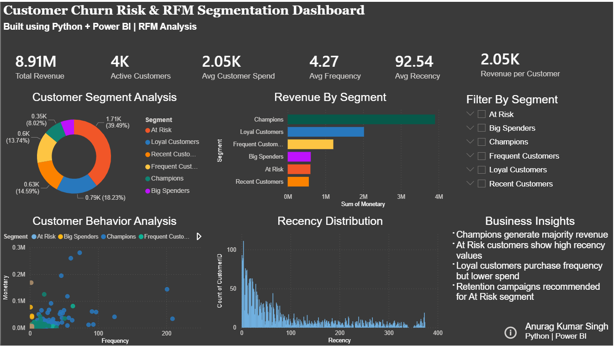

# 📊 Customer Churn Risk & RFM Segmentation Dashboard

> **Built using Python + Power BI | Online Retail Dataset**



---

## 🎯 Project Overview

An end-to-end **Customer Analytics** project that performs **RFM (Recency, Frequency, Monetary)** 
segmentation on an Online Retail dataset to identify customer churn risk and revenue patterns.

---

## 📈 Key Metrics

| Metric | Value |
|---|---|
| 💰 Total Revenue | ₹8.91M |
| 👥 Active Customers | 4,000+ |
| 💳 Avg Customer Spend | ₹2,050 |
| 🔁 Avg Purchase Frequency | 4.27 |

---

## 🧩 Customer Segments Identified

| Segment | Share | Insight |
|---|---|---|
| Champions | 39.49% | Highest revenue generators |
| Loyal Customers | 18.23% | Regular buyers, moderate spend |
| At Risk | 14.59% | Need re-engagement campaigns |
| Frequent Customers | 13.74% | High frequency, lower spend |
| Big Spenders | 8.02% | Low frequency, high value |
| Recent Customers | ~6% | Newly acquired |

---

## 💡 Business Insights

- 🏆 **Champions** drive the majority of total revenue (~₹4M)
- ⚠️ **At Risk customers** show high recency values — urgent retention needed
- 💼 **Loyal customers** purchase frequently but spend less per order
- 📣 **Retention campaigns** recommended for At Risk segment

---

## 🛠️ Tech Stack


---

## 📂 Project Structure
```
customer-churn-rfm-segmentation/
├── data/                          ← not uploaded (see below)
├── notebooks/
│   └── rfm_analysis_clean.ipynb
├── dashboard/
│   └── Customer Churn Analysis_final.pbix
├── Dashboard.png
└── README.md
```

---

## 🚀 How to Run

1. Clone the repo:
   git clone https://github.com/aks-data/customer-churn-rfm-segmentation

2. Download the dataset:
   👉 https://archive.ics.uci.edu/dataset/352/online+retail


   Save it inside the data/ folder as: Online Retail.xlsx

3. Install dependencies:
   pip install pandas numpy matplotlib seaborn

4. Run the notebook:
   jupyter notebook notebooks/rfm_analysis_clean.ipynb

5. Open the dashboard:
   Open dashboard/Customer Churn Analysis_final.pbix in Power BI Desktop
---

## 👤 Author

**Anurag Kumar Singh**  
📧 anuragksingh.da@gmail.com  
🔗 [LinkedIn](https://linkedin.com/in/iamanuragkrsingh)  

